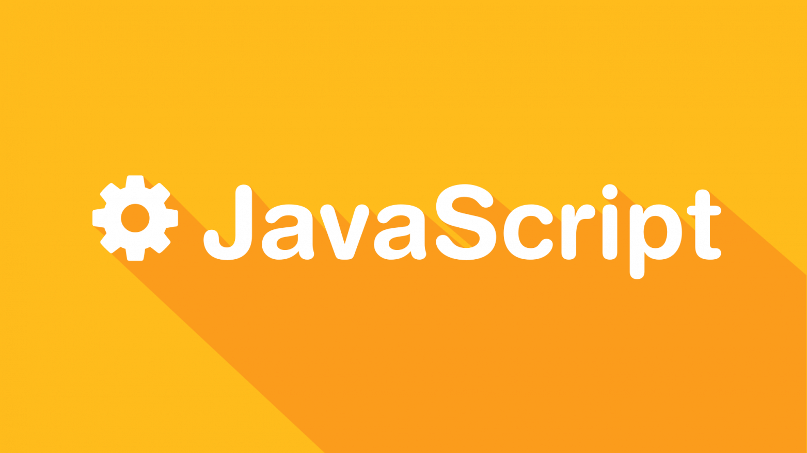

# Web.Developer.am
<html lang="en">
  <head>
    <meta charset="UTF-8" />
    <meta http-equiv="X-UA-Compatible" content="IE=edge" />
    <meta name="viewport" content="width=device-width, initial-scale=1.0" />
    <title>Web Programer Cours</title>
    <link rel="stylesheet" href="News.css" />
  </head>
  <body>
    <nav class="nav">
      

        <h1 class="logo">
          <a href="">Web Developer</a>
        </h1>
        <ul>
          <li><a href="Verify.html">HTML 5</a></li>
          <li><a href="Bled.html">JavaScript</a></li>
          <li><a href="css.html">CSS</a></li>
          <li><a href="https://discord.gg/RP85sjQf">Discord</a></li>
        </ul>
      

    </nav>

    

      

        <h1>Welcome To Web Programs </h1>
        

            Բարի գալուստ Web Programer Cours այստեղ դուք կարողեք անցնել վեբ ծրագրավորման անվճար դասընթացներ
        

      

    

    

      <section class="content">
        <h1>HTML</h1>
        

            
        

      </section>
      <section class="content">
        <h1>CSS</h1>
        

          
        

      </section>
      <section class="content">
        <h1>JavaScript</h1>
        

          
        

      </section>
    

    
  </body>
</html>
